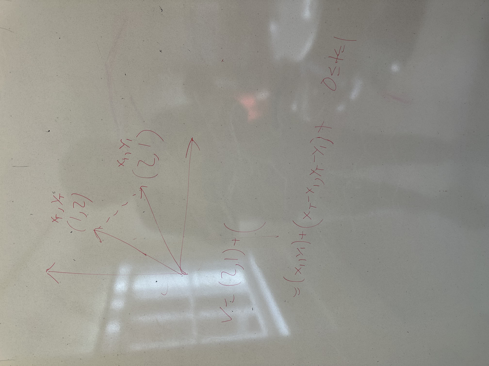

# Meeting Summary + Post Meeting - Nov 16, 2024

## Meeting Summary
1. attempted to implement applying the transformation matrix
2. research on how to display animations on the canvas

## Technical Details
1. idea of using ThreeJS to display animations on the canvas:

2. link of useFrame function in ThreeJS: [Link](https://gracious-keller-98ef35.netlify.app/docs/api/hooks/useFrame/)

## Post Meeting + Resources
Lists of tasks to be completed:
1. Improve the UI (any improvement will work, it currently looks trash lol)
2. Find a way to display texts in the canvas
3. Find a way to apply the transformation matrix to the vectors
4. Add any additional elements that you think will be useful for the project!
5. Make sure the scrollbar is aligned to the very left of the page
6. Resize the canvas to fit the screen on the right side
7. Render 2D Object (circle, square, etc) on the canvas
