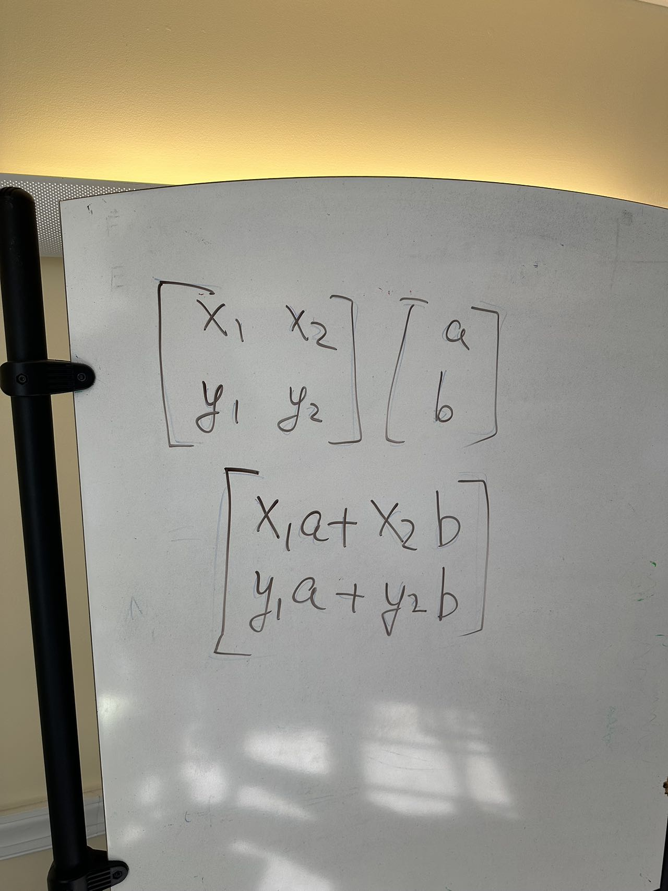

# Meeting Summary + Post Meeting - October 5, 2024

## Meeting Summary
1. More introduction for those who can't make it last time
2. Intro to linear algebra: matrix transformation in 2D
3. A more detailed approach and architecture of the project: Split the input and display to two independent components. The input will be a list of text boxes that the user can input and whenever the input changes it will update a value of the transformation matrix inside the state. The display will be a canvas that will draw a square and apply the transformation matrix to the square and draw the transformed square. The input and display will be connected by a context provider that will provide the transformation matrix to the display component.

## Technical Details
1. Matrix transformation in 2D

2. I can't wrote everything I talked about in the meeting but we pretty much covered the first 4 videos of 3blue1brown's essence of linear algebra series. I encourage everyone to watch the series to get a better understanding of linear algebra.

## Post Meeting + Resources
### Linear algebra:
- [Essence of linear algebra](https://www.youtube.com/watch?v=kjBOesZCoqc&list=PLZHQObOWTQDPD3MizzM2xVFitgF8hE_ab) - I think all we need is the first 6 videos of it
### React:
- [Beginner React Tutorial](https://www.youtube.com/watch?v=SqcY0GlETPk&t=4251s&pp=ygUOcmVhY3QgdHV0b3JpYWw%3D)
- [A more comprehensive react tutorial with a project](https://www.youtube.com/watch?v=LDB4uaJ87e0)
